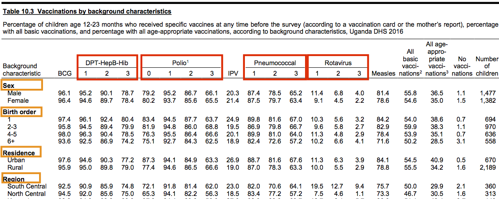

```{r setup, include=FALSE}
options(width = 100)
knitr::opts_chunk$set(
  collapse = TRUE,
  out.width = "100%"
)
library(emo)
library(here)
```

# Free tables from PDF prison! `r emo::ji('hammer_and_pick')` `r emo::ji('hole')` `r emo::ji('helicopter')`

## Motivation
Household surveys, particularly [DHS](https://dhsprogram.com/) and [MICS](http://mics.unicef.org/), are a key global health resource and their results are often relied upon to inform programmatic and strategic decision-making. Unfortunately, these data are scattered across hundreds of pages in a survey report and locked away in PDF format. The goal here is to detail an approach to break out of PDF prison and enjoy the sweet freedom of tidy data frames.

Here is a typical data table from a DHS report - note the liberal use of <span style="color:red">multi-level headers</span> and <span style="color:orange">row headers</span>:


``` {r img1, echo = FALSE, out.width = '100%', fig.cap = "Source: Uganda Bureau of Statistics (UBOS) and ICF. 2018. Uganda Demographic and Health Survey 2016. Kampala, Uganda and Rockville, Maryland, USA: UBOS and ICF."}
```

Sidenote: the DHS Program implemented the [Indicator Data API](https://api.dhsprogram.com/#/index.html) with excellent documentation. This, of course, is ideal as one can interface with DHS survey data without ever touching a PDF `r emo::ji("tada")`  

<center>
#### **`r emo::ji("rotating_light")` Please see my [`fetchdhs`](https://github.com/murphy-xq/fetchdhs) package to do just that! `r emo::ji("rotating_light")`**
</center>

## Extract and tidy

We will be using [`tabulizer`](https://github.com/ropensci/tabulizer), a powerful package that wraps the [`Tabula`](https://tabula.technology/) java library, to convert PDF pages to machine-readable text. Then, we will rely on various [`tidyverse`](https://www.tidyverse.org/) functions to manipulate the text data and produce a tidy data frame of our desired table.

#### Scrape text
Let's try running the table we have just seen through `tabulizer` and see what we get.

```{r raw, echo=TRUE, warning=FALSE}
suppressPackageStartupMessages(library(tidyverse))
library(here)
library(tabulizer)

source <- "dhs_uganda_2016"
raw_txt <- extract_tables(here("report-pdfs", str_c(source,".pdf")), pages = 211, guess = FALSE)

raw_txt[[1]][1:25,]
```

Well, we can work with this! The rows of data are clearly identifiable and anything is better than keying in all those data by hand `r emo::ji("sob")`

#### Split text and create data frame
What we see above is a character matrix of scraped text from `extract_tables()`. To move from this mess to a data frame, let's employ some `regex` to split the row labels from the data values. Fortunately, values following row labels are typically the same format: between 0-100 to the tenths place, e.g. 98.6. So, to split the row labels from the data values, we use a `regex` with that pattern.

We also tighten up the data frame by filtering out completely empty rows and then slicing the data frame per `keys`, which are specific rows that mark the boundaries of data within the table. In this case, we see that the rows `Sex` and `Total` mark the top and bottom rows that contain data values.

```{r str_prep}
# this regex looks for the first space preceding the predominant
# initial data value pattern found in DHS and MICS tables, e.g. 98.6
str_split_regex <- regex("
                         \\s(?=                   # initial space followed by any:
                         \\(?\\d{1,3}[,.]\\d\\)?| # coverage value      (0-100 to the tenths place; optional parens)
                         ^\\d+$|                  # denominator value   (whole numbers)
                         \\(?\\*\\)?|             # special character * (denotes small n; optional parens)
                         na\\s)                   # explicit NA followed by a space
                         ", comments = TRUE)
keys <- c("Sex","Total")

df <- raw_txt %>%
  # string manipulation
  unlist() %>%
  str_squish() %>%                                     # remove extraneous whitespace
  str_split_fixed(str_split_regex, n = 2) %>%          # split row labels from data values
  cbind(., str_split_fixed(.[, 2], "\\s", n = 6)) %>%  # split data values (6 columns for this table)
  .[,-2] %>%                                           # drop column of raw data values

  # build df
  as_tibble() %>%
  na_if("") %>%
  filter(!is.na(.[[1]])) %>%
  slice(str_which(.[[1]], keys[1])[1]:str_which(.[[1]], keys[2])[1])

df

# let's make some quick functions to use later on
split_raw_txt <- function(raw_txt, str_split_regex, n_cols) {
  raw_txt %>%
    unlist() %>%
    str_squish() %>%
    str_replace_all("(\\s\\d+)[\\s,.](\\d{3}\\)?)","\\1\\2") %>%  # harmonize 1,000 separator
    str_replace_all("(\\d)\\,(\\d\\)?\\b)","\\1.\\2") %>%         # harmonize decimal separator
    str_split_fixed(str_split_regex, n = 2) %>%
    cbind(., str_split_fixed(.[, 2], "\\s", n = length(n_cols))) %>%
    .[,-2]
}

build_df <- function(split_txt, keys) {
  split_txt %>%
    as_tibble() %>%
    na_if("") %>%
    filter(!is.na(.[[1]])) %>%
    slice(str_which(.[[1]], keys[1])[1]:str_which(.[[1]], keys[2])[1])
}
```

Success! Oh, but what about those pesky row headers?

#### Address row headers
I like to think of the row headers as the grouping variable for the sets of row labels. We leverage the existing structure of the data frame, where row headers only contain `NA`s, to create the `row_grp` variable and filter out the original header rows. Note that we check for any summary row by detecing the string `Total`, in this case, to ensure that row label is retained.

```{r row-headers}
df_row_headr <- df %>%
  mutate(row_grp = if_else(is.na(.[[2]]) | str_detect(.[[1]],str_c(keys, collapse = "|")), .[[1]], NA_character_)) %>%
  fill(row_grp) %>%
  filter(!is.na(.[2])) %>%
  mutate(row_grp = if_else(is.na(row_grp), .[[1]], row_grp)) %>%
  select(row_grp, everything())

df_row_headr

# let's wrap this into a function as well
clean_row_headr <- function(df, keys) {
  df %>%
    mutate(row_grp = if_else(is.na(.[[2]]) | str_detect(.[[1]], str_c(keys, collapse = "|")), .[[1]], NA_character_)) %>%
    fill(row_grp) %>%
    filter(!is.na(.[2])) %>%
    mutate(row_grp = if_else(is.na(row_grp), .[[1]], row_grp)) %>%
    select(row_grp, everything())
}
```

#### Assemble column headers
Unfortunately, `tabulizer` does not reliably parse column headers from DHS and MICS tables due to their often irregular, multi-level structure. Because of this, we write a function `make_headr` to assemble the desired column `headers`. We feed the function each level of the column headers: <span style="color:red">parent</span> or <span style="color:blue">child</span>.


``` {r img2, echo = FALSE, out.width = '100%', fig.cap = "Source: Uganda Bureau of Statistics (UBOS) and ICF. 2018. Uganda Demographic and Health Survey 2016. Kampala, Uganda and Rockville, Maryland, USA: UBOS and ICF."}
```

```{r assemble_headers}
make_col_headr <- function(child, parent, sep = "_") {
  if (class(child) == "list") {
    child %>%
      map2(., parent, ~str_c(.x, .y, sep = sep)) %>%
      unlist()
  } else {
    parent %>%
      map(~str_c(child, .x, sep = sep)) %>%
      unlist()
  }
}

# In the above image, we see that Table 10.4 has a set of 3 column headers
# repeated twice - once for each age group: 12-23 month and 24-35 months
headr_list <- list(
  child = c("vacc-card-ever", "vacc-card-seen","denom"),
  parent = c("age12-23m","age24-35m")
  )
headers <- make_col_headr(headr_list$child, headr_list$parent)
headers

# we can now set the appropriate column headers
df_row_headr %>%
  set_names(c("row_grp", "row_lbl", headers))
```

#### Tidy up the data frame

```{r tidy_df}
tidy_df <- df_row_headr %>%
  set_names(c("row_grp", "row_lbl", headers)) %>%
  gather("indicator", "value", -row_grp, -row_lbl) %>%
  separate(indicator, c("indicator","denom_lbl"), sep = "_")

tidy_df
```

## Iterate

In practice, you would be looking to extract a series of tables across several PDFs. To accomplish this, we create a tibble of arguments to pass to a new function `scrape_table()` and use `pmap()` to iterate.

#### Wrap a function
We put the helper functions `split_raw_txt()` `build_df()` `make_col_headr()` to work inside the `scrape_table()` function.

```{r func}
scrape_table <- function(source_folder, source, tbl_id, pg, keys, str_split_regex, headers) {

  # build column headers
  col_hdrs <- headers %>%
    pmap(make_col_headr) %>%
    unlist()

  # scrape table
  orig <- extract_tables(here(source_folder, str_c(source, ".pdf")), pages = pg, guess = FALSE) %>%
    split_raw_txt(str_split_regex, col_hdrs) %>%
    build_df(keys) %>%
    clean_row_headr(keys) %>%
    set_names(c("row_grp", "row_lbl", col_hdrs))

  # reshape table
  rshp <- orig %>%
    gather("indicator", "value", -row_grp, -row_lbl) %>%
    mutate(source = str_remove(source, "\\.pdf"),
           tbl_id = tbl_id) %>%
    select(source, tbl_id, everything())

  list(orig, rshp)
}

# run a table and inspect output
headr_list <- list(
  child =  list(c("vacc-card-ever","vacc-card-seen","denom")),
  parent = list(c("age12-23m","age24-35"))
  )

scrape_table(
  source_folder = "report-pdfs",
  source = "dhs_uganda_2016",
  tbl_id = "tbl_10.4",
  pg = 211,
  keys = c("Sex", "Total"),
  headers = headr_list,
  str_split_regex = "\\s(?=\\d+.\\d)"
  )
```

#### Scrape various tables from multiple PDFs
Using `scrape_table()` and `pmap()`, we will scrape and tidy 8 tables out of 4 survey reports:
[DHS Uganda 2016](https://dhsprogram.com/publications/publication-FR333-DHS-Final-Reports.cfm); 
[MICS Democratic People's Republic of Korea 2017](http://mics.unicef.org/surveys); 
[DHS Haiti 2016-2017](https://dhsprogram.com/publications/publication-PR90-Preliminary-Reports-Key-Indicators-Reports.cfm); and 
[MICS Paraguay 2016](http://mics.unicef.org/surveys).

```{r pmap}
split_regex <- "\\s(?=\\(?\\d{1,2}[,.]\\d|^\\d+$|\\(?\\*\\)?|na\\s)"  # same regex outline above

# create nested df of column headers
headr_df <- tribble(
  ~tbl_id, ~child, ~parent,
  "hti_tbl_25.2",  list(c("hiv-positive","denom"), c("hiv-positive","denom"), c("hiv-positive","denom")), c("female","male","all"),
  "hti_tbl_28",    list(c("fever-2wks-prior","denom"), c("treatment-advice-sought","finder-heel-blood-test","antibiotics","denom")),
                   c("age0-4m","age0-4m-fever"),
  "prk_tc_1.1",    list(c("vacc-record","mother-report","either","vacc-by-12-mos"),
                        c("vacc-record","mother-report","either","vacc-by-24-mos")),
                   c("age12-23m", "age24-35m"),
  "prk_tc_2.1",    c("episode-diarrhoea","ari-syptoms","episode-fever","denom"), "age0-59m",
  "pry_nu_5",      c("breastfeed-median-any","breastfeed-median-excl","breastfeed-median-predom","denom"), "age0-35m",
  "pry_mt_2",      c("computer-ever-used","computer-used-12m","computer-used-1perweek-lastmonth",
                     "internet-ever-used","internet-used-12m","internet-used-1perweek-lastmonth", "denom"), "age15-24y",
  "uga_tbl_10.14", c("per-attend-ece","denom"),"age12-23m",
  "uga_tbl_11.8",  c("any-anaemia","mild-anaemia","moderate-anaemia","severe-anaemia","denom"), "age6-59m"
  ) %>%
  nest(child, parent, .key = "headers")

# ensure tribble column names match scrape_table() argument names
tbl_scrape_args <- tribble(
  ~source, ~tbl_id, ~pg, ~keys,
  "dhs_haiti_2017",     "hti_tbl_25.2",  62,  c("Milieu de résidence", "Ensemble 15-64"),
  "dhs_haiti_2017",     "hti_tbl_28",    66,  c("Milieu de Résidence", "Ensemble"),
  "mics_nkorea_2017",   "prk_tc_1.1",    80,  c("BCG", "^Number"),
  "mics_nkorea_2017",   "prk_tc_2.1",    84,  c("Total", "40 percent highest"),
  "mics_paraguay_2016", "pry_nu_5",      75,  c("Mediana$", "Media$"),
  "mics_paraguay_2016", "pry_mt_2",      241, c("Total", "idioma$"),
  "dhs_uganda_2016",    "uga_tbl_10.14", 221, c("Age", "Total"),
  "dhs_uganda_2016",    "uga_tbl_11.8",  247, c("Age in months", "Total")
  ) %>%
  # add arguments that do not vary
  mutate(source_folder = "report-pdfs",
         str_split_regex = split_regex) %>%
  # pull in column headers
  left_join(., headr_df, by = "tbl_id")

# pass args tibble through pmap()
tbl_scrapes <- tbl_scrape_args %>%
  mutate(output = pmap(., scrape_table))

tbl_scrapes
```

Great! We have a data frame that includes all the input parameters as well as a list-column containing the scraped and reshaped tables. Let's take a look at the output to make sure we are on track and then use `map_dfr` to row-bind all reshaped data frames into a single `master_df`:

```{r output, warning=FALSE}
# inspect some table output
tbl_scrapes[['output']][[4]][[1]]
tbl_scrapes[['output']][[4]][[2]]

# row-bind all reshaped data frames from 'output' list-column
full_rshp <- tbl_scrapes[["output"]] %>%
  map_dfr(2) %>%
  separate(source, c("svy_type", "country", "year"), sep = "-", remove = FALSE) %>%
  separate(indicator, c("indicator","denom_grp"), sep = "_") %>%
  mutate(value = as.numeric(value),
         # key needed to create `denom_values` variable in `master_df`
         denom_key = str_c(source, tbl_id, row_grp, row_lbl, denom_grp, sep = "_"))

full_rshp

# use right_join() to match denominator value for each observation
master_df <- full_rshp %>%
  filter(str_detect(indicator, "denom")) %>%
  select(denom_value = value, denom_key) %>%
  right_join(., full_rshp, by = "denom_key") %>%
  filter(!str_detect(indicator, "denom")) %>%
  select(svy_type:indicator, value, denom_grp, denom_value)

master_df
```

### We just built a function that scraped 8 tables of data from 4 different PDFs and created a tidy data frame `r emo::ji("clap")` `r emo::ji("clap")` `r emo::ji("clap")`

<center>

</center>