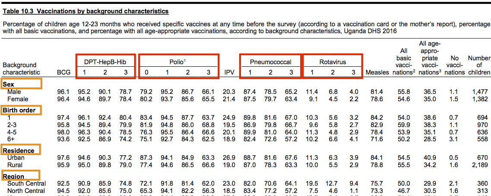
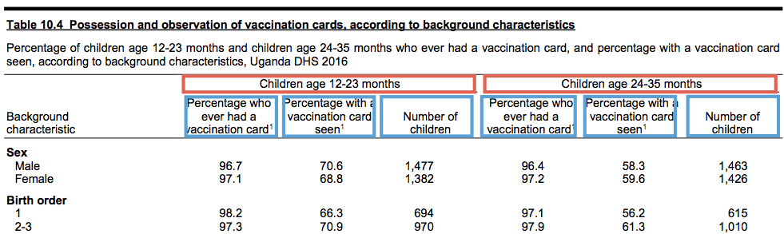

# Free tables from PDF prison\! ⚒ 🕳 🚁

## Motivation

Household surveys, particularly [DHS](https://dhsprogram.com/) and
[MICS](http://mics.unicef.org/), are a key global health resource and
their results are often relied upon to inform programmatic and strategic
decision-making. Unfortunately, these data are scattered across hundreds
of pages in a survey report and locked away in PDF format. The goal here
is to detail an approach to break out of PDF prison and enjoy the sweet
freedom of tidy data frames.

Here is a typical data table from a DHS report - note the liberal use of
<span style="color:red">multi-level headers</span> and
<span style="color:orange">row headers</span>:



Sidenote: the DHS Program implemented the [Indicator Data
API](https://api.dhsprogram.com/#/index.html) with excellent
documentation. This, of course, is ideal as one can interface with DHS
survey data without ever touching a PDF
🎉

<p align="center">

#### **🚨 Please see my [`fetchdhs`](https://github.com/murphy-xq/fetchdhs) package to do just that\! 🚨**

</p>

## Extract and tidy

We will be using [`tabulizer`](https://github.com/ropensci/tabulizer), a
powerful package that wraps the [`Tabula`](https://tabula.technology/)
java library, to convert PDF pages to machine-readable text. Then, we
will rely on various [`tidyverse`](https://www.tidyverse.org/) functions
to manipulate the text data and produce a tidy data frame of our desired
table.

#### Scrape text

Let’s try running the table we have just seen through `tabulizer` and
see what we get.

``` r
suppressPackageStartupMessages(library(tidyverse))
library(here)
library(tabulizer)

source <- "dhs_uganda_2016"
raw_txt <- extract_tables(here("report-pdfs", str_c(source,".pdf")), pages = 211, guess = FALSE)

raw_txt[[1]][1:25,]
##  [1] "Table 10.4  Possession and observation of vaccination cards, according to background characteristics"                                         
##  [2] "Percentage of children age 12-23 months and children age 24-35 months who ever had a vaccination card, and percentage with a vaccination card"
##  [3] "seen, according to background characteristics, Uganda DHS 2016"                                                                               
##  [4] "Children age 12-23 months Children age 24-35 months"                                                                                          
##  [5] "Percentage who Percentage with a Percentage who Percentage with a"                                                                            
##  [6] "Background  ever had a vaccination card Number of ever had a vaccination card Number of"                                                      
##  [7] "characteristic vaccination card1 seen1 children vaccination card1 seen1 children"                                                             
##  [8] "Sex"                                                                                                                                          
##  [9] "Male 96.7 70.6 1,477 96.4 58.3 1,463"                                                                                                         
## [10] "Female 97.1 68.8 1,382 97.2 59.6 1,426"                                                                                                       
## [11] ""                                                                                                                                             
## [12] "Birth order"                                                                                                                                  
## [13] "1 98.2 66.3 694 97.1 56.2 615"                                                                                                                
## [14] "2-3 97.3 70.9 970 97.9 61.3 1,010"                                                                                                            
## [15] "4-5 98.2 71.5 636 96.8 56.4 607"                                                                                                              
## [16] "6+ 93.2 69.8 558 94.7 60.0 658"                                                                                                               
## [17] ""                                                                                                                                             
## [18] "Residence"                                                                                                                                    
## [19] "Urban 96.5 63.5 670 97.1 54.2 613"                                                                                                            
## [20] "Rural 97.1 71.6 2,189 96.7 60.2 2,277"                                                                                                        
## [21] ""                                                                                                                                             
## [22] "Region"                                                                                                                                       
## [23] "South Central 95.8 65.4 360 95.3 48.2 386"                                                                                                    
## [24] "North Central 96.9 67.0 313 95.1 53.3 282"                                                                                                    
## [25] "Kampala 95.0 56.2 143 98.5 54.2 109"
```

Well, we can work with this\! The rows of data are clearly identifiable
and anything is better than keying in all those data by hand 😭

#### Split text and create data frame

What we see above is a character matrix of scraped text from
`extract_tables()`. To move from this mess to a data frame, let’s employ
some `regex` to split the row labels from the data values. Fortunately,
values following row labels are typically the same format: between 0-100
to the tenths place, e.g. 98.6. So, to split the row labels from the
data values, we use a `regex` with that pattern.

We also tighten up the data frame by filtering out completely empty rows
and then slicing the data frame per `keys`, which are specific rows that
mark the boundaries of data within the table. In this case, we see that
the rows `Sex` and `Total` mark the top and bottom rows that contain
data values.

``` r
# this regex looks for the first space preceding the predominant
# initial data value pattern found in DHS and MICS tables, e.g. 98.6
str_split_regex <- regex("
                         \\s(?=                   # initial space followed by any:
                         \\(?\\d{1,3}[,.]\\d\\)?| # coverage value      (0-100 to the tenths place; optional parens)
                         ^\\d+$|                  # denominator value   (whole numbers)
                         \\(?\\*\\)?|             # special character * (denotes small n; optional parens)
                         na\\s)                   # explicit NA followed by a space
                         ", comments = TRUE)
keys <- c("Sex","Total")

df <- raw_txt %>%
  # string manipulation
  unlist() %>%
  str_squish() %>%                                     # remove extraneous whitespace
  str_split_fixed(str_split_regex, n = 2) %>%          # split row labels from data values
  cbind(., str_split_fixed(.[, 2], "\\s", n = 6)) %>%  # split data values (6 columns for this table)
  .[,-2] %>%                                           # drop column of raw data values

  # build df
  as_tibble() %>%
  na_if("") %>%
  filter(!is.na(.[[1]])) %>%
  slice(str_which(.[[1]], keys[1])[1]:str_which(.[[1]], keys[2])[1])

df
## # A tibble: 43 x 7
##    V1          V2    V3    V4    V5    V6    V7   
##    <chr>       <chr> <chr> <chr> <chr> <chr> <chr>
##  1 Sex         <NA>  <NA>  <NA>  <NA>  <NA>  <NA> 
##  2 Male        96.7  70.6  1,477 96.4  58.3  1,463
##  3 Female      97.1  68.8  1,382 97.2  59.6  1,426
##  4 Birth order <NA>  <NA>  <NA>  <NA>  <NA>  <NA> 
##  5 1           98.2  66.3  694   97.1  56.2  615  
##  6 2-3         97.3  70.9  970   97.9  61.3  1,010
##  7 4-5         98.2  71.5  636   96.8  56.4  607  
##  8 6+          93.2  69.8  558   94.7  60.0  658  
##  9 Residence   <NA>  <NA>  <NA>  <NA>  <NA>  <NA> 
## 10 Urban       96.5  63.5  670   97.1  54.2  613  
## # ... with 33 more rows

# let's make some quick functions to use later on
split_raw_txt <- function(raw_txt, str_split_regex, n_cols) {
  raw_txt %>%
    unlist() %>%
    str_squish() %>%
    str_replace_all("(\\s\\d+)[\\s,.](\\d{3}\\)?)","\\1\\2") %>%  # harmonize 1,000 separator
    str_replace_all("(\\d)\\,(\\d\\)?\\b)","\\1.\\2") %>%         # harmonize decimal separator
    str_split_fixed(str_split_regex, n = 2) %>%
    cbind(., str_split_fixed(.[, 2], "\\s", n = length(n_cols))) %>%
    .[,-2]
}

build_df <- function(split_txt, keys) {
  split_txt %>%
    as_tibble() %>%
    na_if("") %>%
    filter(!is.na(.[[1]])) %>%
    slice(str_which(.[[1]], keys[1])[1]:str_which(.[[1]], keys[2])[1])
}
```

Success\! Oh, but what about those pesky row headers?

#### Address row headers

I like to think of the row headers as the grouping variable for the sets
of row labels. We leverage the existing structure of the data frame,
where row headers only contain `NA`s, to create the `row_grp` variable
and filter out the original header rows. Note that we check for any
summary row by detecing the string `Total`, in this case, to ensure that
row label is retained.

``` r
df_row_headr <- df %>%
  mutate(row_grp = if_else(is.na(.[[2]]) | str_detect(.[[1]],str_c(keys, collapse = "|")), .[[1]], NA_character_)) %>%
  fill(row_grp) %>%
  filter(!is.na(.[2])) %>%
  mutate(row_grp = if_else(is.na(row_grp), .[[1]], row_grp)) %>%
  select(row_grp, everything())

df_row_headr
## # A tibble: 36 x 8
##    row_grp     V1            V2    V3    V4    V5    V6    V7   
##    <chr>       <chr>         <chr> <chr> <chr> <chr> <chr> <chr>
##  1 Sex         Male          96.7  70.6  1,477 96.4  58.3  1,463
##  2 Sex         Female        97.1  68.8  1,382 97.2  59.6  1,426
##  3 Birth order 1             98.2  66.3  694   97.1  56.2  615  
##  4 Birth order 2-3           97.3  70.9  970   97.9  61.3  1,010
##  5 Birth order 4-5           98.2  71.5  636   96.8  56.4  607  
##  6 Birth order 6+            93.2  69.8  558   94.7  60.0  658  
##  7 Residence   Urban         96.5  63.5  670   97.1  54.2  613  
##  8 Residence   Rural         97.1  71.6  2,189 96.7  60.2  2,277
##  9 Region      South Central 95.8  65.4  360   95.3  48.2  386  
## 10 Region      North Central 96.9  67.0  313   95.1  53.3  282  
## # ... with 26 more rows

# let's wrap this into a function as well
clean_row_headr <- function(df, keys) {
  df %>%
    mutate(row_grp = if_else(is.na(.[[2]]) | str_detect(.[[1]], str_c(keys, collapse = "|")), .[[1]], NA_character_)) %>%
    fill(row_grp) %>%
    filter(!is.na(.[2])) %>%
    mutate(row_grp = if_else(is.na(row_grp), .[[1]], row_grp)) %>%
    select(row_grp, everything())
}
```

#### Assemble column headers

Unfortunately, `tabulizer` does not reliably parse column headers from
DHS and MICS tables due to their often irregular, multi-level structure.
Because of this, we write a function `make_headr` to assemble the
desired column `headers`. We feed the function each level of the column
headers: <span style="color:red">parent</span> or
<span style="color:blue">child</span>.



``` r
make_col_headr <- function(child, parent, sep = "_") {
  if (class(child) == "list") {
    child %>%
      map2(., parent, ~str_c(.x, .y, sep = sep)) %>%
      unlist()
  } else {
    parent %>%
      map(~str_c(child, .x, sep = sep)) %>%
      unlist()
  }
}

# In the above image, we see that Table 10.4 has a set of 3 column headers
# repeated twice - once for each age group: 12-23 month and 24-35 months
headr_list <- list(
  child = c("vacc-card-ever", "vacc-card-seen","denom"),
  parent = c("age12-23m","age24-35m")
  )
headers <- make_col_headr(headr_list$child, headr_list$parent)
headers
## [1] "vacc-card-ever_age12-23m" "vacc-card-seen_age12-23m" "denom_age12-23m"         
## [4] "vacc-card-ever_age24-35m" "vacc-card-seen_age24-35m" "denom_age24-35m"

# we can now set the appropriate column headers
df_row_headr %>%
  set_names(c("row_grp", "row_lbl", headers))
## # A tibble: 36 x 8
##    row_grp row_lbl `vacc-card-ever… `vacc-card-seen… `denom_age12-23… `vacc-card-ever…
##    <chr>   <chr>   <chr>            <chr>            <chr>            <chr>           
##  1 Sex     Male    96.7             70.6             1,477            96.4            
##  2 Sex     Female  97.1             68.8             1,382            97.2            
##  3 Birth … 1       98.2             66.3             694              97.1            
##  4 Birth … 2-3     97.3             70.9             970              97.9            
##  5 Birth … 4-5     98.2             71.5             636              96.8            
##  6 Birth … 6+      93.2             69.8             558              94.7            
##  7 Reside… Urban   96.5             63.5             670              97.1            
##  8 Reside… Rural   97.1             71.6             2,189            96.7            
##  9 Region  South … 95.8             65.4             360              95.3            
## 10 Region  North … 96.9             67.0             313              95.1            
## # ... with 26 more rows, and 2 more variables: `vacc-card-seen_age24-35m` <chr>,
## #   `denom_age24-35m` <chr>
```

#### Tidy up the data frame

``` r
tidy_df <- df_row_headr %>%
  set_names(c("row_grp", "row_lbl", headers)) %>%
  gather("indicator", "value", -row_grp, -row_lbl) %>%
  separate(indicator, c("indicator","denom_lbl"), sep = "_")

tidy_df
## # A tibble: 216 x 5
##    row_grp     row_lbl       indicator      denom_lbl value
##    <chr>       <chr>         <chr>          <chr>     <chr>
##  1 Sex         Male          vacc-card-ever age12-23m 96.7 
##  2 Sex         Female        vacc-card-ever age12-23m 97.1 
##  3 Birth order 1             vacc-card-ever age12-23m 98.2 
##  4 Birth order 2-3           vacc-card-ever age12-23m 97.3 
##  5 Birth order 4-5           vacc-card-ever age12-23m 98.2 
##  6 Birth order 6+            vacc-card-ever age12-23m 93.2 
##  7 Residence   Urban         vacc-card-ever age12-23m 96.5 
##  8 Residence   Rural         vacc-card-ever age12-23m 97.1 
##  9 Region      South Central vacc-card-ever age12-23m 95.8 
## 10 Region      North Central vacc-card-ever age12-23m 96.9 
## # ... with 206 more rows
```

## Iterate

In practice, you would be looking to extract a series of tables across
several PDFs. To accomplish this, we create a tibble of arguments to
pass to a new function `scrape_table()` and use `pmap()` to iterate.

#### Wrap a function

We put the helper functions `split_raw_txt()` `build_df()`
`make_col_headr()` to work inside the `scrape_table()`
function.

``` r
scrape_table <- function(source_folder, source, tbl_id, pg, keys, str_split_regex, headers) {

  # build column headers
  col_hdrs <- headers %>%
    pmap(make_col_headr) %>%
    unlist()

  # scrape table
  orig <- extract_tables(here(source_folder, str_c(source, ".pdf")), pages = pg, guess = FALSE) %>%
    split_raw_txt(str_split_regex, col_hdrs) %>%
    build_df(keys) %>%
    clean_row_headr(keys) %>%
    set_names(c("row_grp", "row_lbl", col_hdrs))

  # reshape table
  rshp <- orig %>%
    gather("indicator", "value", -row_grp, -row_lbl) %>%
    mutate(source = str_remove(source, "\\.pdf"),
           tbl_id = tbl_id) %>%
    select(source, tbl_id, everything())

  list(orig, rshp)
}

# run a table and inspect output
headr_list <- list(
  child =  list(c("vacc-card-ever","vacc-card-seen","denom")),
  parent = list(c("age12-23m","age24-35"))
  )

scrape_table(
  source_folder = "report-pdfs",
  source = "dhs_uganda_2016",
  tbl_id = "tbl_10.4",
  pg = 211,
  keys = c("Sex", "Total"),
  headers = headr_list,
  str_split_regex = "\\s(?=\\d+.\\d)"
  )
## [[1]]
## # A tibble: 36 x 8
##    row_grp row_lbl `vacc-card-ever… `vacc-card-seen… `denom_age12-23… `vacc-card-ever…
##    <chr>   <chr>   <chr>            <chr>            <chr>            <chr>           
##  1 Sex     Male    96.7             70.6             1477             96.4            
##  2 Sex     Female  97.1             68.8             1382             97.2            
##  3 Birth … 1       98.2             66.3             694              97.1            
##  4 Birth … 2-3     97.3             70.9             970              97.9            
##  5 Birth … 4-5     98.2             71.5             636              96.8            
##  6 Birth … 6+      93.2             69.8             558              94.7            
##  7 Reside… Urban   96.5             63.5             670              97.1            
##  8 Reside… Rural   97.1             71.6             2189             96.7            
##  9 Region  South … 95.8             65.4             360              95.3            
## 10 Region  North … 96.9             67.0             313              95.1            
## # ... with 26 more rows, and 2 more variables: `vacc-card-seen_age24-35` <chr>,
## #   `denom_age24-35` <chr>
## 
## [[2]]
## # A tibble: 216 x 6
##    source          tbl_id   row_grp     row_lbl       indicator                value
##    <chr>           <chr>    <chr>       <chr>         <chr>                    <chr>
##  1 dhs_uganda_2016 tbl_10.4 Sex         Male          vacc-card-ever_age12-23m 96.7 
##  2 dhs_uganda_2016 tbl_10.4 Sex         Female        vacc-card-ever_age12-23m 97.1 
##  3 dhs_uganda_2016 tbl_10.4 Birth order 1             vacc-card-ever_age12-23m 98.2 
##  4 dhs_uganda_2016 tbl_10.4 Birth order 2-3           vacc-card-ever_age12-23m 97.3 
##  5 dhs_uganda_2016 tbl_10.4 Birth order 4-5           vacc-card-ever_age12-23m 98.2 
##  6 dhs_uganda_2016 tbl_10.4 Birth order 6+            vacc-card-ever_age12-23m 93.2 
##  7 dhs_uganda_2016 tbl_10.4 Residence   Urban         vacc-card-ever_age12-23m 96.5 
##  8 dhs_uganda_2016 tbl_10.4 Residence   Rural         vacc-card-ever_age12-23m 97.1 
##  9 dhs_uganda_2016 tbl_10.4 Region      South Central vacc-card-ever_age12-23m 95.8 
## 10 dhs_uganda_2016 tbl_10.4 Region      North Central vacc-card-ever_age12-23m 96.9 
## # ... with 206 more rows
```

#### Scrape various tables from multiple PDFs

Using `scrape_table()` and `pmap()`, we will scrape and tidy 8 tables
out of 4 survey reports: [DHS
Uganda 2016](https://dhsprogram.com/publications/publication-FR333-DHS-Final-Reports.cfm);
[MICS Democratic People’s Republic of
Korea 2017](http://mics.unicef.org/surveys); [DHS
Haiti 2016-2017](https://dhsprogram.com/publications/publication-PR90-Preliminary-Reports-Key-Indicators-Reports.cfm);
and [MICS
Paraguay 2016](http://mics.unicef.org/surveys).

``` r
split_regex <- "\\s(?=\\(?\\d{1,2}[,.]\\d|^\\d+$|\\(?\\*\\)?|na\\s)"  # same regex outline above

# create nested df of column headers
headr_df <- tribble(
  ~tbl_id, ~child, ~parent,
  "hti_tbl_25.2",  list(c("hiv-positive","denom"), c("hiv-positive","denom"), c("hiv-positive","denom")), c("female","male","all"),
  "hti_tbl_28",    list(c("fever-2wks-prior","denom"), c("treatment-advice-sought","finder-heel-blood-test","antibiotics","denom")),
                   c("age0-4m","age0-4m-fever"),
  "prk_tc_1.1",    list(c("vacc-record","mother-report","either","vacc-by-12-mos"),
                        c("vacc-record","mother-report","either","vacc-by-24-mos")),
                   c("age12-23m", "age24-35m"),
  "prk_tc_2.1",    c("episode-diarrhoea","ari-syptoms","episode-fever","denom"), "age0-59m",
  "pry_nu_5",      c("breastfeed-median-any","breastfeed-median-excl","breastfeed-median-predom","denom"), "age0-35m",
  "pry_mt_2",      c("computer-ever-used","computer-used-12m","computer-used-1perweek-lastmonth",
                     "internet-ever-used","internet-used-12m","internet-used-1perweek-lastmonth", "denom"), "age15-24y",
  "uga_tbl_10.14", c("per-attend-ece","denom"),"age12-23m",
  "uga_tbl_11.8",  c("any-anaemia","mild-anaemia","moderate-anaemia","severe-anaemia","denom"), "age6-59m"
  ) %>%
  nest(child, parent, .key = "headers")

# ensure tribble column names match scrape_table() argument names
tbl_scrape_args <- tribble(
  ~source, ~tbl_id, ~pg, ~keys,
  "dhs_haiti_2017",     "hti_tbl_25.2",  62,  c("Milieu de résidence", "Ensemble 15-64"),
  "dhs_haiti_2017",     "hti_tbl_28",    66,  c("Milieu de Résidence", "Ensemble"),
  "mics_nkorea_2017",   "prk_tc_1.1",    80,  c("BCG", "^Number"),
  "mics_nkorea_2017",   "prk_tc_2.1",    84,  c("Total", "40 percent highest"),
  "mics_paraguay_2016", "pry_nu_5",      75,  c("Mediana$", "Media$"),
  "mics_paraguay_2016", "pry_mt_2",      241, c("Total", "idioma$"),
  "dhs_uganda_2016",    "uga_tbl_10.14", 221, c("Age", "Total"),
  "dhs_uganda_2016",    "uga_tbl_11.8",  247, c("Age in months", "Total")
  ) %>%
  # add arguments that do not vary
  mutate(source_folder = "report-pdfs",
         str_split_regex = split_regex) %>%
  # pull in column headers
  left_join(., headr_df, by = "tbl_id")

# pass args tibble through pmap()
tbl_scrapes <- tbl_scrape_args %>%
  mutate(output = pmap(., scrape_table))

tbl_scrapes
## # A tibble: 8 x 8
##   source      tbl_id       pg keys    source_folder str_split_regex               headers    output 
##   <chr>       <chr>     <dbl> <list>  <chr>         <chr>                         <list>     <list> 
## 1 dhs_haiti_… hti_tbl_…    62 <chr [… report-pdfs   "\\s(?=\\(?\\d{1,2}[,.]\\d|^… <tibble [… <list …
## 2 dhs_haiti_… hti_tbl_…    66 <chr [… report-pdfs   "\\s(?=\\(?\\d{1,2}[,.]\\d|^… <tibble [… <list …
## 3 mics_nkore… prk_tc_1…    80 <chr [… report-pdfs   "\\s(?=\\(?\\d{1,2}[,.]\\d|^… <tibble [… <list …
## 4 mics_nkore… prk_tc_2…    84 <chr [… report-pdfs   "\\s(?=\\(?\\d{1,2}[,.]\\d|^… <tibble [… <list …
## 5 mics_parag… pry_nu_5     75 <chr [… report-pdfs   "\\s(?=\\(?\\d{1,2}[,.]\\d|^… <tibble [… <list …
## 6 mics_parag… pry_mt_2    241 <chr [… report-pdfs   "\\s(?=\\(?\\d{1,2}[,.]\\d|^… <tibble [… <list …
## 7 dhs_uganda… uga_tbl_…   221 <chr [… report-pdfs   "\\s(?=\\(?\\d{1,2}[,.]\\d|^… <tibble [… <list …
## 8 dhs_uganda… uga_tbl_…   247 <chr [… report-pdfs   "\\s(?=\\(?\\d{1,2}[,.]\\d|^… <tibble [… <list …
```

Great\! We have a data frame that includes all the input parameters as
well as a list-column containing the scraped and reshaped tables. Let’s
take a look at the output to make sure we are on track and then use
`map_dfr` to row-bind all reshaped data frames into a single
`master_df`:

``` r
# inspect some table output
tbl_scrapes[['output']][[4]][[1]]
## # A tibble: 26 x 6
##    row_grp  row_lbl    `episode-diarrhoea_a… `ari-syptoms_age0… `episode-fever_age… `denom_age0-59m`
##    <chr>    <chr>      <chr>                 <chr>              <chr>               <chr>           
##  1 Total    Total      11.4                  0.5                6.8                 2275            
##  2 Sex      Male       12.3                  0.4                6.0                 1164            
##  3 Sex      Female     10.5                  0.6                7.6                 1111            
##  4 Area     Urban      10.1                  0.6                6.9                 1361            
##  5 Area     Rural      13.4                  0.4                6.6                 914             
##  6 Province Ryanggang  10.5                  0.9                8.3                 71              
##  7 Province North Ham… 12.7                  1.3                5.8                 221             
##  8 Province South Ham… 10.6                  0.0                9.2                 298             
##  9 Province Kangwon    9.9                   2.2                6.5                 148             
## 10 Province Jagang     12.8                  0.4                7.3                 131             
## # ... with 16 more rows
tbl_scrapes[['output']][[4]][[2]]
## # A tibble: 104 x 6
##    source           tbl_id     row_grp  row_lbl        indicator                  value
##    <chr>            <chr>      <chr>    <chr>          <chr>                      <chr>
##  1 mics_nkorea_2017 prk_tc_2.1 Total    Total          episode-diarrhoea_age0-59m 11.4 
##  2 mics_nkorea_2017 prk_tc_2.1 Sex      Male           episode-diarrhoea_age0-59m 12.3 
##  3 mics_nkorea_2017 prk_tc_2.1 Sex      Female         episode-diarrhoea_age0-59m 10.5 
##  4 mics_nkorea_2017 prk_tc_2.1 Area     Urban          episode-diarrhoea_age0-59m 10.1 
##  5 mics_nkorea_2017 prk_tc_2.1 Area     Rural          episode-diarrhoea_age0-59m 13.4 
##  6 mics_nkorea_2017 prk_tc_2.1 Province Ryanggang      episode-diarrhoea_age0-59m 10.5 
##  7 mics_nkorea_2017 prk_tc_2.1 Province North Hamgyong episode-diarrhoea_age0-59m 12.7 
##  8 mics_nkorea_2017 prk_tc_2.1 Province South Hamgyong episode-diarrhoea_age0-59m 10.6 
##  9 mics_nkorea_2017 prk_tc_2.1 Province Kangwon        episode-diarrhoea_age0-59m 9.9  
## 10 mics_nkorea_2017 prk_tc_2.1 Province Jagang         episode-diarrhoea_age0-59m 12.8 
## # ... with 94 more rows

# row-bind all reshaped data frames from 'output' list-column
full_rshp <- tbl_scrapes[["output"]] %>%
  map_dfr(2) %>%
  separate(source, c("svy_type", "country", "year"), sep = "_", remove = FALSE) %>%
  separate(indicator, c("indicator","denom_grp"), sep = "_") %>%
  mutate(value = as.numeric(value))

full_rshp
## # A tibble: 1,079 x 10
##    source     svy_type country year  tbl_id    row_grp       row_lbl      indicator  denom_grp value
##    <chr>      <chr>    <chr>   <chr> <chr>     <chr>         <chr>        <chr>      <chr>     <dbl>
##  1 dhs_haiti… dhs      haiti   2017  hti_tbl_… Milieu de ré… Urbain       hiv-posit… female      2.2
##  2 dhs_haiti… dhs      haiti   2017  hti_tbl_… Milieu de ré… Rural        hiv-posit… female      2.4
##  3 dhs_haiti… dhs      haiti   2017  hti_tbl_… Département   Aire Métrop… hiv-posit… female      2.1
##  4 dhs_haiti… dhs      haiti   2017  hti_tbl_… Département   Reste Ouest  hiv-posit… female      1.6
##  5 dhs_haiti… dhs      haiti   2017  hti_tbl_… Département   Sud-Est      hiv-posit… female      3.2
##  6 dhs_haiti… dhs      haiti   2017  hti_tbl_… Département   Nord         hiv-posit… female      2.7
##  7 dhs_haiti… dhs      haiti   2017  hti_tbl_… Département   Nord-Est     hiv-posit… female      2.1
##  8 dhs_haiti… dhs      haiti   2017  hti_tbl_… Département   Artibonite   hiv-posit… female      3.3
##  9 dhs_haiti… dhs      haiti   2017  hti_tbl_… Département   Centre       hiv-posit… female      1.5
## 10 dhs_haiti… dhs      haiti   2017  hti_tbl_… Département   Sud          hiv-posit… female      2  
## # ... with 1,069 more rows

# implement a self-join to match denominator value for each observation
master_df <- full_rshp %>%
  left_join(x = filter(., !str_detect(indicator, "denom")),
            y = filter(., str_detect(indicator, "denom")),
            by = c("source", "tbl_id", "row_grp", "row_lbl", "denom_grp")) %>% 
  select(source, svy_type = svy_type.x, country = country.x, year = year.x,
         tbl_id, row_grp, row_lbl, indicator = indicator.x, value = value.x,
         denom_grp, denom_value = value.y)

master_df
## # A tibble: 802 x 11
##    source   svy_type country year  tbl_id  row_grp   row_lbl   indicator value denom_grp denom_value
##    <chr>    <chr>    <chr>   <chr> <chr>   <chr>     <chr>     <chr>     <dbl> <chr>           <dbl>
##  1 dhs_hai… dhs      haiti   2017  hti_tb… Milieu d… Urbain    hiv-posi…   2.2 female           4479
##  2 dhs_hai… dhs      haiti   2017  hti_tb… Milieu d… Rural     hiv-posi…   2.4 female           5118
##  3 dhs_hai… dhs      haiti   2017  hti_tb… Départem… Aire Mét… hiv-posi…   2.1 female           2438
##  4 dhs_hai… dhs      haiti   2017  hti_tb… Départem… Reste Ou… hiv-posi…   1.6 female           1559
##  5 dhs_hai… dhs      haiti   2017  hti_tb… Départem… Sud-Est   hiv-posi…   3.2 female            502
##  6 dhs_hai… dhs      haiti   2017  hti_tb… Départem… Nord      hiv-posi…   2.7 female           1044
##  7 dhs_hai… dhs      haiti   2017  hti_tb… Départem… Nord-Est  hiv-posi…   2.1 female            355
##  8 dhs_hai… dhs      haiti   2017  hti_tb… Départem… Artiboni… hiv-posi…   3.3 female           1373
##  9 dhs_hai… dhs      haiti   2017  hti_tb… Départem… Centre    hiv-posi…   1.5 female            612
## 10 dhs_hai… dhs      haiti   2017  hti_tb… Départem… Sud       hiv-posi…   2   female            626
## # ... with 792 more rows
```

### We just built a function that scraped 8 tables of data from 4 different PDFs and created a tidy data frame 👏 👏 👏

<p align="center">


</p>
